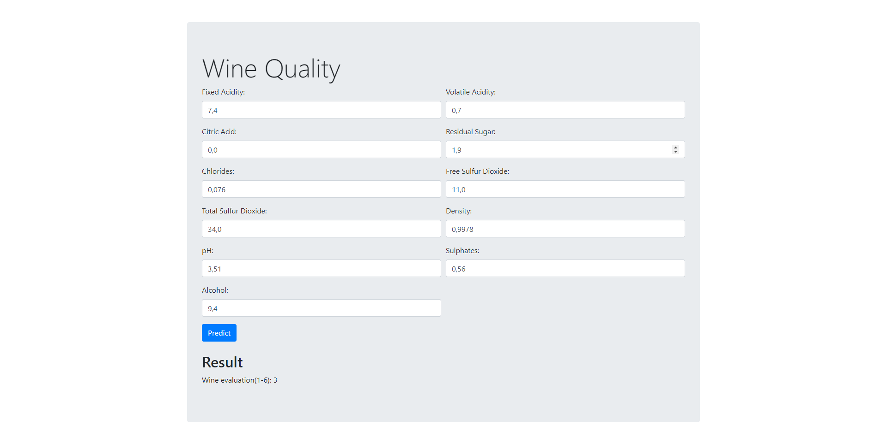
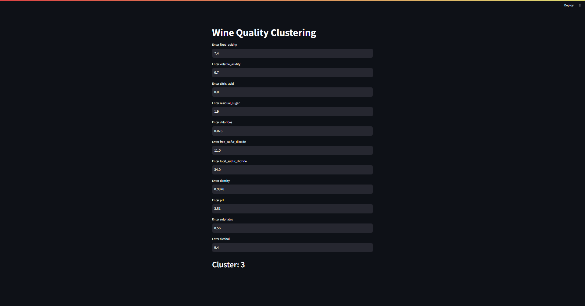

# RedWineClusteringML
This project focuses on creating a web application for the clustering of red wines based on various attributes. The application utilizes a machine learning model trained on a dataset of wine attributes to make predictions.
### ***Created by Team23***

<br>

## Attribute Information:

The following attributes are used for wine clustering:

- **Fixed Acidity**
- **Volatile Acidity**
- **Citric Acid**
- **Residual Sugar**
- **Chlorides**
- **Free Sulfur Dioxide**
- **Total Sulfur Dioxide**
- **Density**
- **pH**
- **Sulphates**
- **Alcohol**

### Kaggle: https://www.kaggle.com/code/vigneshprakash/red-wine-data-eda-clustering-and-classification

<br>

## Getting Started

1. Clone the repository:

    ```bash
    git clone https://github.com/jabka1/RedWineClusteringML
    cd wine-quality-clustering-web-app
    ```

<br>

## Usage

### 1. Train the Clustering Model

To train the clustering model, open a terminal in the project folder and run the following command:

```bash
python training/train_model.py
```

### 2. Start Flask App
To start the Flask app, open a terminal in the project folder and run:

```bash
app.py
```
The Flask app will be accessible at http://localhost:5000.

### 3. Start Streamlit App
Open a new terminal in the project folder and run:

```bash
streamlit streamlit/streamlit_app.py
```
The Streamlit app will be accessible at http://localhost:8501.

<br>

## Demo

### Flask


<br>

### Streamlit


<br>
